# AI Study Companion — System Architecture

**Document Type:** Technical System Architecture  
**Architecture Version:** Current Implementation  
**Scope:** Production-relevant architecture and implemented learning flows  
**Diagram Format:** Mermaid

---

# 1. Executive Architecture Overview

The **AI Study Companion** is a project-scoped AI learning platform that transforms uploaded study materials into a structured knowledge base and uses that knowledge to support grounded tutoring, assessment, mastery measurement, growth analysis, and personalized learning recommendations.

The architecture is intentionally divided into two categories:

- **AI-assisted capabilities:** document understanding, knowledge extraction, Tutor generation, quiz generation, open-ended evaluation, and figure processing.
- **Deterministic learning logic:** authorization, scoring, mastery calculation, growth, mismatch detection, recommendation scoring, and adaptive next-question selection.

The central learning loop is:

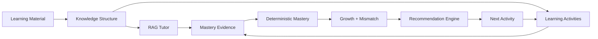

The architecture is built around four primary principles:

1. **Project-level data isolation**
2. **Grounded AI generation**
3. **Asynchronous document processing**
4. **Deterministic learning analytics**

---

# 2. High-Level System Architecture

The application follows a **modular monolithic architecture**. The backend is a single FastAPI application organized into domain-oriented services rather than independently deployed microservices.

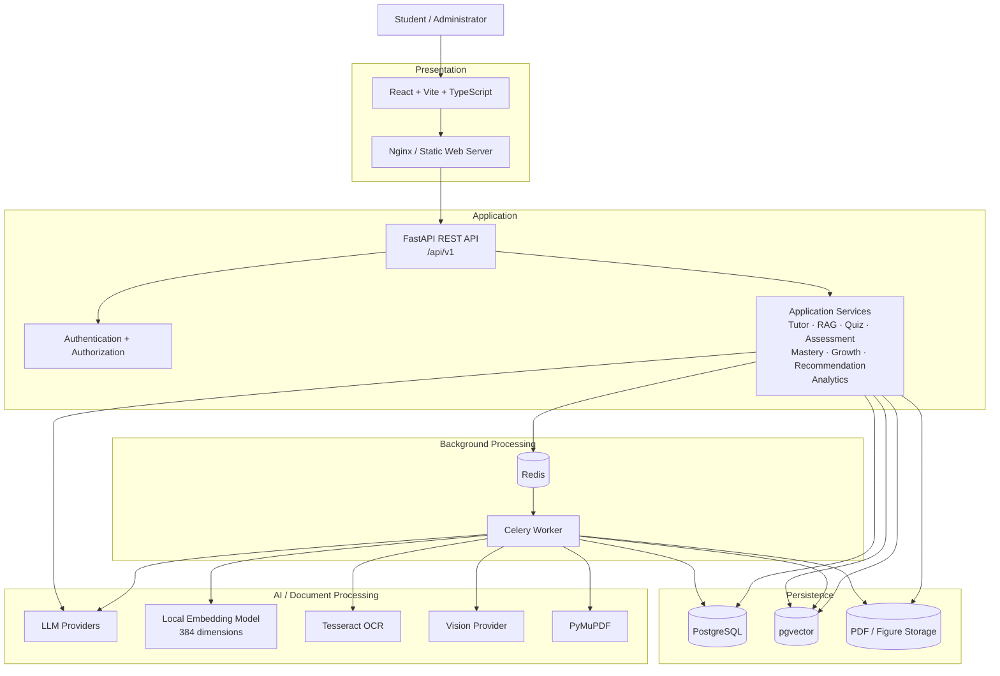

## Architectural Boundary

The frontend does not directly access PostgreSQL, Redis, Celery, or AI providers.

The normal request path is:

```text
React
  ↓
FastAPI Router
  ↓
Application / Domain Service
  ↓
Persistence / AI / Infrastructure
```

The architecture is therefore a **modular monolith with asynchronous workers**, not a collection of independently deployed backend microservices.

---

# 3. Application Architecture

## 3.1 Frontend Architecture

The frontend is a React SPA using Vite and TypeScript. It communicates with versioned backend APIs under `/api/v1`.

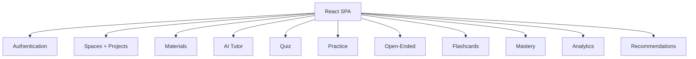

The frontend is responsible for presentation, client-side state, routing, API communication, and learning workflows.

---

## 3.2 Backend Architecture

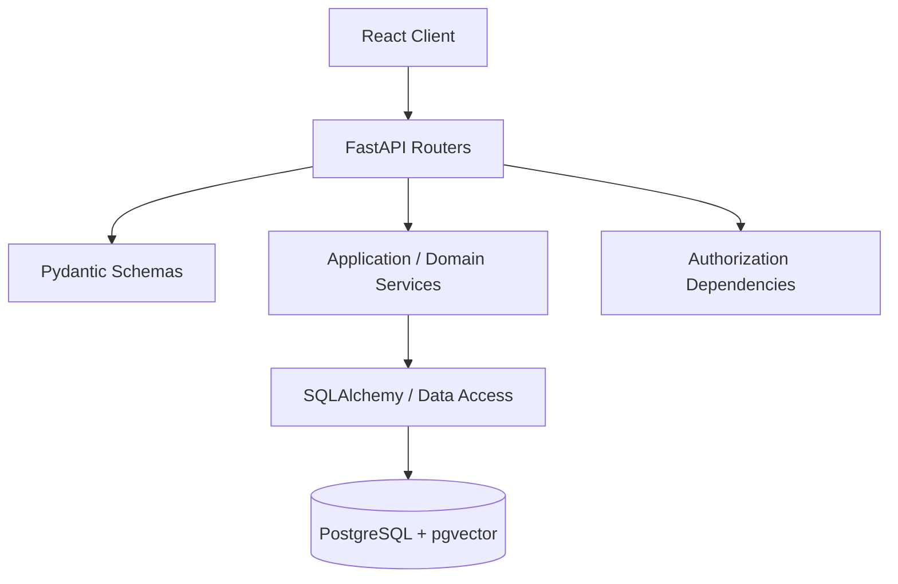

The routers are intentionally thin. Business rules such as mastery, recommendation scoring, retrieval, quiz adaptation, and evidence creation live in services.

Representative service responsibilities include:

- Tutor and conversation services
- Retrieval / RAG
- Quiz generation and quiz attempts
- Open-ended assessment
- Mastery
- Growth
- Mismatch
- Recommendation
- Analytics
- Document processing

---

# 4. Document Ingestion and Knowledge Architecture

This is one of the primary asynchronous pipelines in the platform.

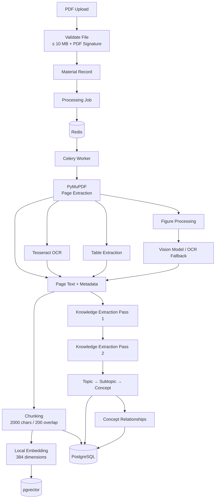

## Processing Stages

1. Validate the uploaded PDF.
2. Create material and processing-job records.
3. Dispatch document processing to the background worker.
4. Extract page text with PyMuPDF.
5. Use Tesseract for pages requiring OCR.
6. Extract tables where available.
7. Process document figures through the vision pipeline.
8. Chunk extracted content.
9. Generate 384-dimensional local embeddings.
10. Persist chunks and embeddings.
11. Run structured knowledge extraction.
12. Persist the Topic → Subtopic → Concept hierarchy and relationships.

## Knowledge Model

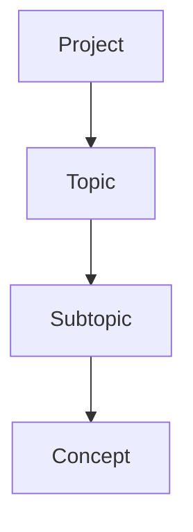

The knowledge structure is reused by Tutor grounding, quiz generation, practice selection, assessment, mastery, and analytics.

---

# 5. RAG and AI Tutor Architecture

The Tutor is grounded in project-specific material through vector retrieval.

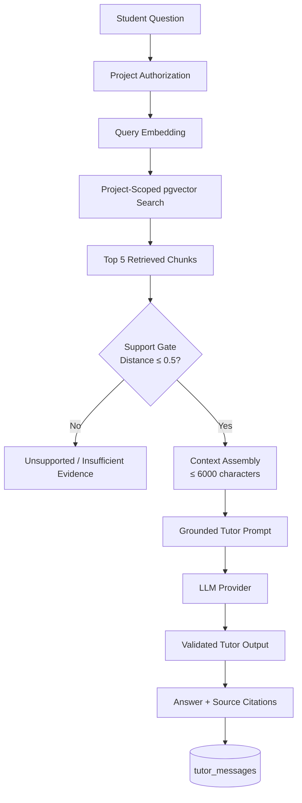

## Tutor Evidence Extension

A normal Tutor message does not automatically create mastery evidence. A student can explicitly demonstrate understanding through the Tutor Check flow:

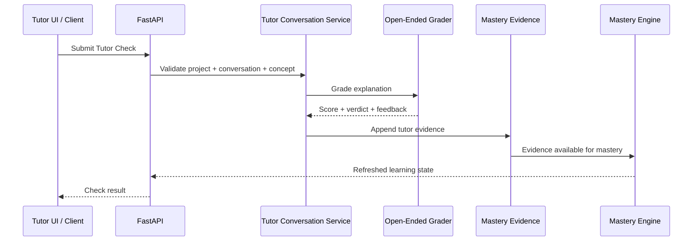

This creates a real production path:

```text
Grounded Tutor Exchange
       ↓
Explicit Tutor Check
       ↓
Open-Ended Grading
       ↓
Tutor Mastery Evidence
       ↓
Mastery Engine
```

**Current boundary:** the Tutor Check requires an explicit in-project `concept_id`; automatic concept detection from free-form Tutor conversation is not implemented.

---

# 6. Assessment and Adaptive Quiz Architecture

The quiz architecture contains two levels of adaptation:

1. **Generation-time adaptation**
2. **Answer-time sequential adaptation**

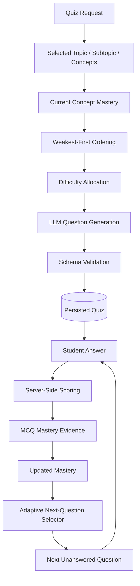

## Difficulty Bands

| Current Mastery | Target Difficulty |
|---|---|
| `< 34` | Easy |
| `34–66` | Medium |
| `> 66` | Hard |

## Answer-Time Adaptation

After an answer is submitted:

```text
Answer
  ↓
Server-side correctness
  ↓
MCQ evidence
  ↓
Updated mastery state
  ↓
Adaptive selector
  ↓
Next question
```

The selector uses existing quiz questions and considers:

- Current concept mastery
- Weakest-first priority
- Difficulty match
- Previous exposure
- Attempt scope
- Curriculum ordering
- Already answered questions

This is **sequential adaptive question selection**.

It does not claim unlimited dynamic question generation during an attempt.

---

# 7. Learning Evidence and Deterministic Mastery Architecture

Learning activities produce append-only evidence.

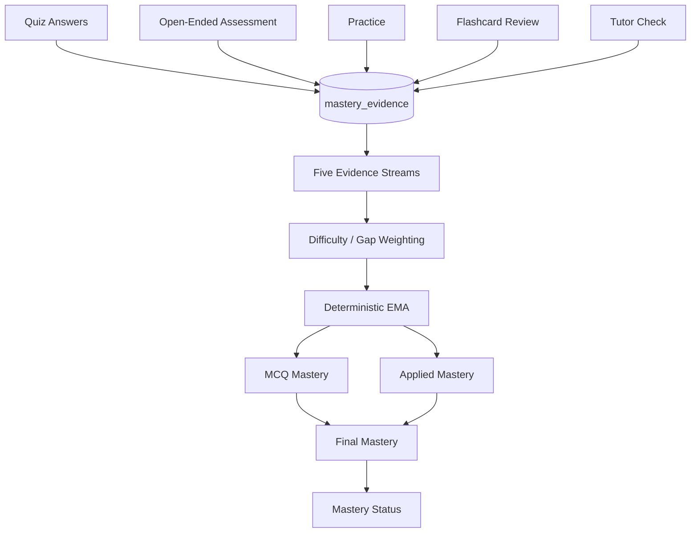

## Five Streams

The implemented mastery model uses five streams:

- Tutor
- Quiz
- Practice / Applied
- Flashcard
- Open-Ended

## EMA Calculation

The stream calculation follows:

```text
Mₖ = Mₖ₋₁ + wₖ(Sₖ − Mₖ₋₁)
```

Where:

- `Mₖ` is the updated mastery
- `Mₖ₋₁` is the previous mastery
- `Sₖ` is the evidence score
- `wₖ` is the effective evidence weight

The existing difficulty weighting, gap weighting, caps, and MCQ/Applied aggregation remain deterministic.

### Persistence Model

Historical learning evidence is stored in the append-only `mastery_evidence` table.

There is no separate persisted `concept_mastery` table in the current implementation. Mastery is derived from evidence.

---

# 8. Growth, Mismatch, and Recommendation Architecture

The platform derives higher-level learning signals from mastery and evidence history.

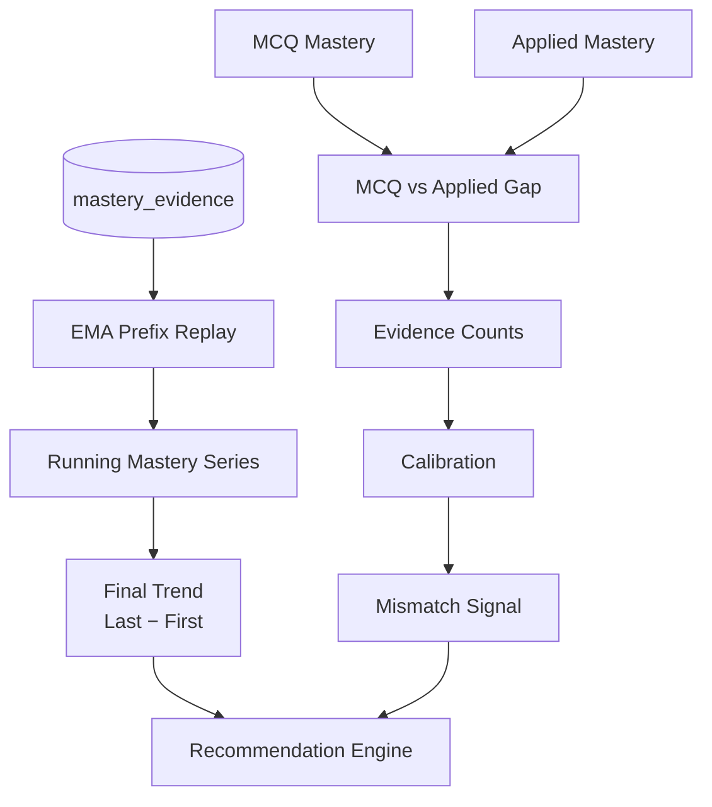

## Growth → Recommendation

The current production connection is:

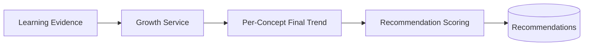

The current implementation uses a decline signal:

```text
Trend ≤ -10
    ↓
+15 recommendation score
```

Improving, stable, and insufficient histories are neutral under the current scoring implementation.

## Mismatch

Mismatch is derived from the existing MCQ-versus-Applied mastery relationship, evidence counts, and calibration logic.

It is a signal to the recommendation engine rather than an independently persisted mastery state.

---

# 9. Recommendation and Continuous Learning Architecture

The recommendation engine combines multiple deterministic signals.

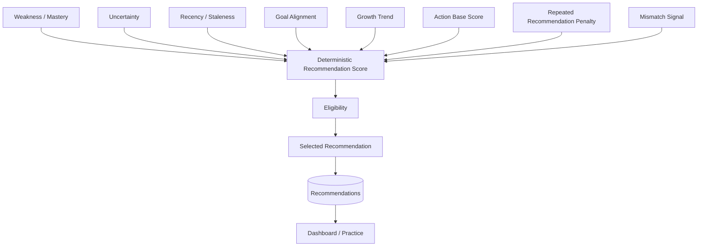

Conceptually:

```text
score =
    weakness
  + uncertainty
  + recency
  + goal
  + growth
  + action base
  - repetition
  ± mismatch
```

The recommendation system remains deterministic. The LLM does not choose the final recommendation.

## Continuous Learning Loop

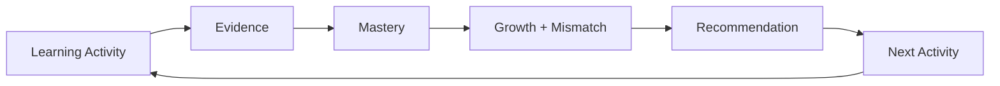

This closes the main recommendation loop:

```text
Learning
  ↓
Evidence
  ↓
Mastery
  ↓
Growth / Mismatch
  ↓
Recommendation
  ↓
Next Activity
```

---

# 10. Security, Async Processing, Observability, and Deployment

## 10.1 Security Architecture

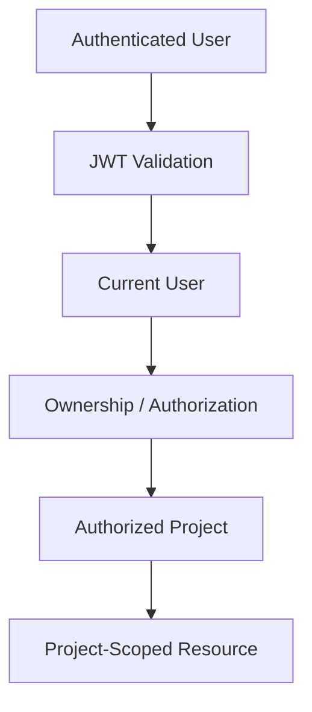

Authentication uses:

- Argon2id password hashing
- JWT bearer authentication
- HS256 signing
- Token expiration
- Project/resource ownership checks

Project isolation is enforced through authorization dependencies and project-scoped database/retrieval queries.

---

## 10.2 Asynchronous Processing

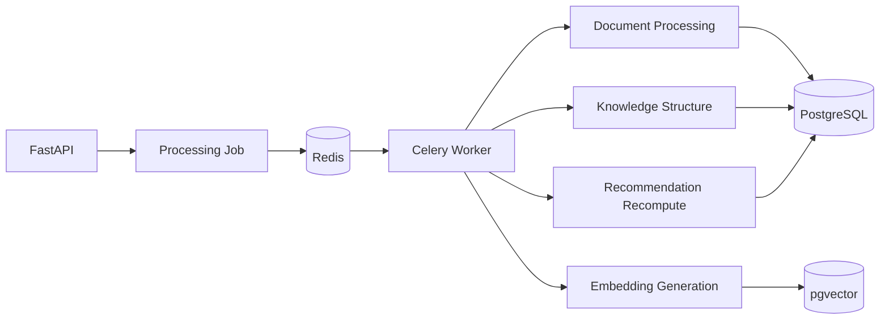

Long-running document workloads are moved out of normal API request processing.

### Reliability Boundary

The current implementation still has known asynchronous reliability limitations, including incomplete retry behavior for some downstream stages and cases where task dispatch failure can leave a processing job in a failed state after the upload request has been accepted.

---

## 10.3 AI Usage and Observability

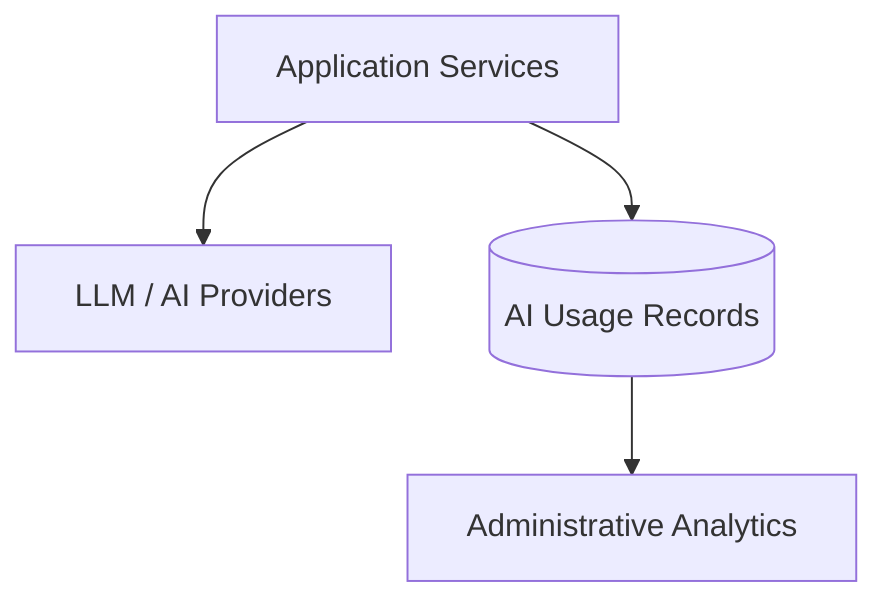

AI usage tracking records operational information such as:

- Provider
- Model
- Token usage
- Latency
- Cost
- Operation context

The AI usage model does not store prompt text.

---

## 10.4 Deployment Architecture

### Docker Compose

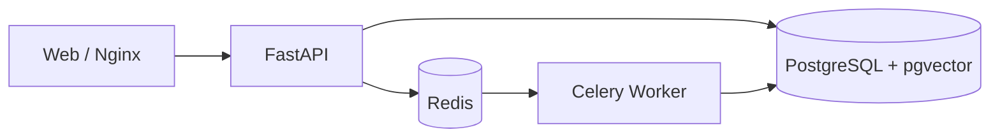

The local Compose architecture separates the web, API, worker, Redis, and PostgreSQL services.

### Railway

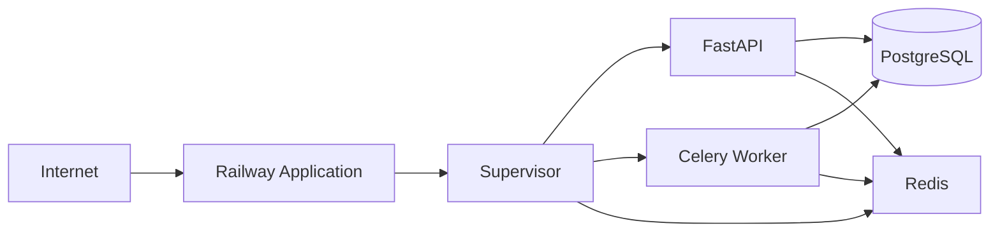

The current Railway deployment uses a single application container managed by Supervisor, rather than reproducing the complete Docker Compose topology as separate cloud containers.

---

# End-to-End Architecture

The complete platform can be viewed as four connected architectural layers.

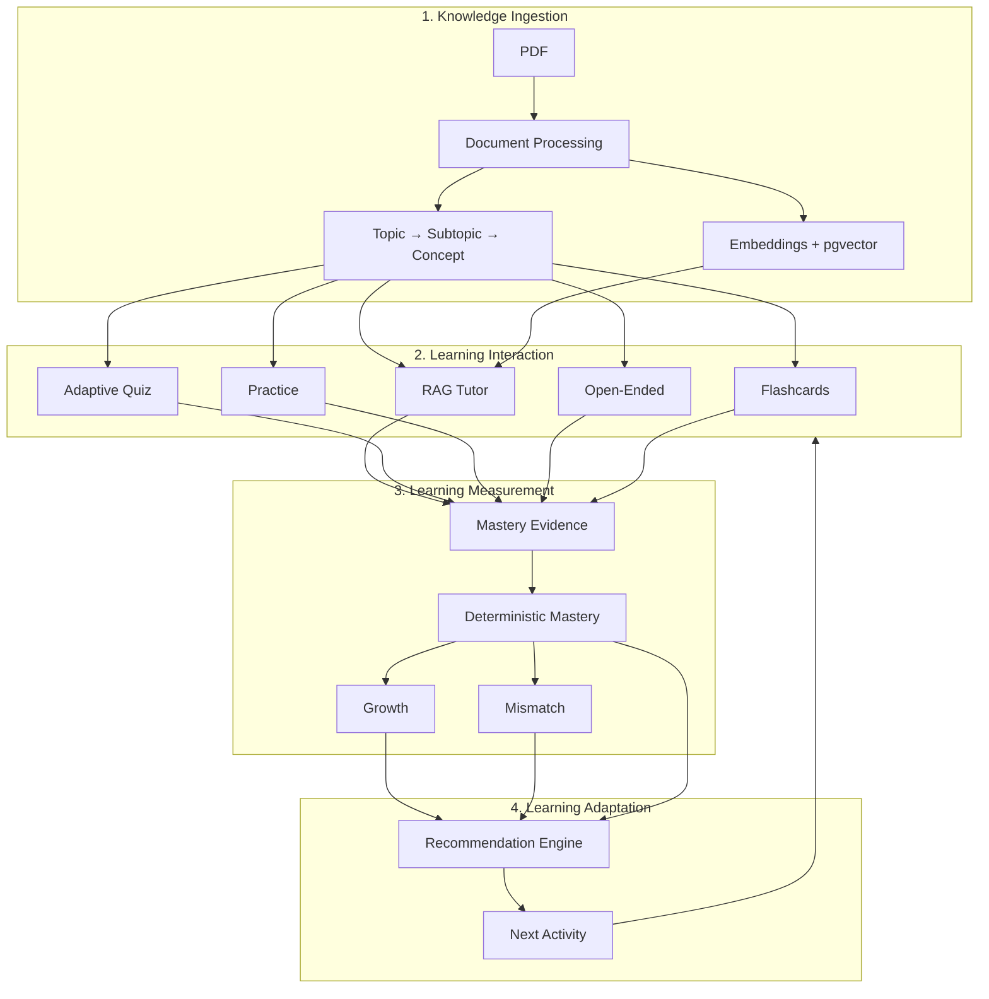

---

# Core Adaptive Quiz Loop

```mermaid
sequenceDiagram
    participant Student
    participant API as FastAPI
    participant Quiz as Quiz Service
    participant Evidence as Mastery Evidence
    participant Mastery as Mastery Engine
    participant Selector as Adaptive Selector

    Student->>API: Submit Answer
    API->>Quiz: Validate Attempt + Answer
    Quiz->>Quiz: Server-side Scoring
    Quiz->>Evidence: Append MCQ Evidence
    Evidence->>Mastery: Evidence Available
    Mastery-->>Selector: Current Mastery
    Selector->>Quiz: Select Next Unanswered Question
    Quiz-->>API: Score + Next Question
    API-->>Student: Result + Adaptive Next Question
```

---

# Architecture Status

| Architecture Edge | Status |
|---|---|
| Material → Knowledge | Implemented |
| Knowledge → RAG Tutor | Implemented |
| Tutor → Tutor Evidence | Implemented through explicit Tutor Check |
| Assessment → Mastery Evidence | Implemented |
| Quiz Answer → Mastery Evidence | Implemented |
| Mastery Evidence → Deterministic Mastery | Implemented |
| Mastery → Growth | Implemented |
| Mastery → Mismatch | Implemented |
| Growth → Recommendation | Implemented |
| Recommendation → Dashboard / Practice | Implemented |
| Quiz Answer → Adaptive Next Question | Implemented |

---

# Current Implementation Boundaries

The following points should be represented accurately in architecture documentation:

1. **Tutor concept association:** Tutor evidence currently requires an explicit in-project `concept_id`; automatic concept detection from free-form Tutor text is not implemented.
2. **Tutor evidence UX:** The Tutor Check API is implemented, but the dedicated one-click Tutor Check UI is not yet integrated into the main Tutor experience.
3. **Adaptive quiz scope:** Answer-time adaptation selects from unanswered questions in the existing pre-generated quiz. It does not generate unlimited new questions mid-attempt.
4. **Growth signal:** Growth currently influences recommendation scoring primarily through the implemented declining-trend signal. Improving/stable/thin histories are neutral.
5. **Recommendation recomputation:** Per-answer mastery updates do not trigger recommendation recomputation; existing completion/dashboard mechanisms handle recomputation.
6. **Async reliability:** Some background-processing retry and dispatch-failure behavior remains incomplete.
7. **AI evaluation:** AI usage/admin aggregation and automated tests exist, but there is no production golden dataset or human groundedness/retrieval judgment framework.
8. **Deployment topology:** Docker Compose and Railway use different runtime topologies.
9. **Mastery persistence:** Mastery is derived from append-only evidence rather than a persisted `concept_mastery` table.
10. **Tutor conversational context:** Conversation messages are persisted, but the current Tutor generation path does not treat the full persisted conversation history as model context.

---

# Technology Stack

| Layer | Technology |
|---|---|
| Frontend | React + TypeScript |
| Build | Vite |
| Styling | Tailwind CSS |
| Backend | FastAPI |
| API | REST / JSON |
| Validation | Pydantic |
| ORM | SQLAlchemy |
| Database | PostgreSQL |
| Vector Search | pgvector |
| Authentication | JWT |
| Password Hashing | Argon2id |
| Background Processing | Celery |
| Message Broker | Redis |
| PDF Processing | PyMuPDF |
| OCR | Tesseract |
| Embeddings | Local 384-dimensional model |
| Text Generation | LLM Providers |
| Vision | Vision Model Provider |
| Containerization | Docker |
| Local Orchestration | Docker Compose |
| Cloud Deployment | Railway |
| Process Management | Supervisor |

---

# Architectural Characteristics

## Modularity

Domain responsibilities are separated into application services while remaining within one backend application.

## Project Isolation

User-owned projects form the main security boundary for learning materials, retrieval, activities, and learning data.

## Grounded AI

Tutor generation is preceded by project-scoped retrieval and an evidence-support gate.

## Deterministic Learning Measurement

Mastery, growth, mismatch, recommendation scoring, and next-question selection use explicit deterministic rules.

## Asynchronous Processing

PDF extraction, OCR, embeddings, structure extraction, and recommendation recomputation can execute through Celery workers.

## Unified Persistence

PostgreSQL provides relational persistence while pgvector provides vector similarity search within the same database system.

## Observable AI Usage

AI operations are tracked for operational usage and administrative analytics.

## Extensible AI Layer

AI providers are accessed through application-level integrations so the core learning logic is not dependent on a single generative model.

---

# Final Architecture Summary

The AI Study Companion is a **project-scoped modular monolith with asynchronous background processing and an AI-assisted learning layer**.

Its architecture connects:

```text
Learning Materials
       ↓
Document Processing
       ↓
Knowledge Structure + Vector Index
       ↓
Project-Scoped RAG Tutor
       ↓
Learning Activities
       ↓
Append-Only Learning Evidence
       ↓
Deterministic Mastery
       ↓
Growth + Mismatch
       ↓
Recommendation Engine
       ↓
Next Learning Activity
```

The quiz path adds a second feedback loop:

```text
Quiz Question
       ↓
Student Answer
       ↓
Server-Side Scoring
       ↓
MCQ Evidence
       ↓
Updated Mastery
       ↓
Adaptive Question Selection
       ↓
Next Question
```

Together, these flows turn the platform from a collection of independent AI features into an integrated learning system in which **learning activity produces measurable evidence, evidence updates deterministic learning state, and learning state influences subsequent activity selection**.

The architecture documentation deliberately reflects the current implementation rather than describing unimplemented capabilities as completed.
