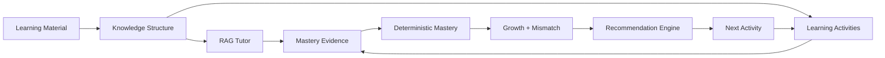
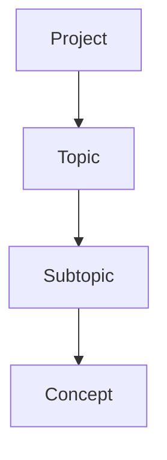
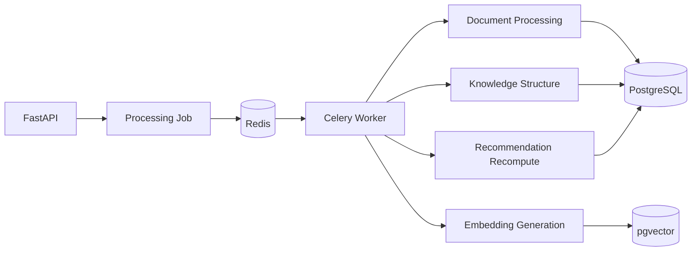
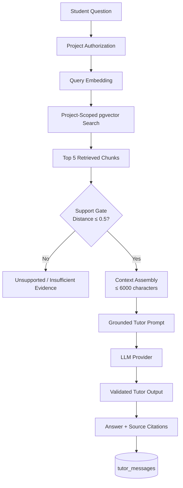
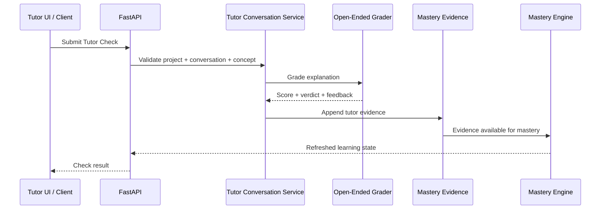
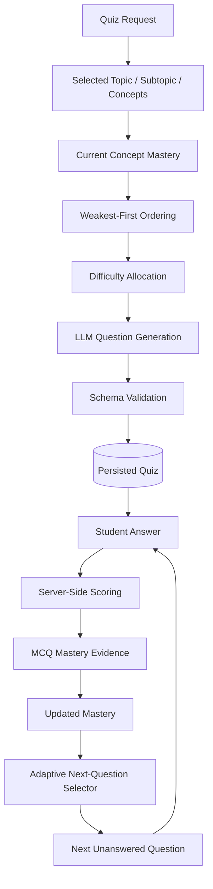
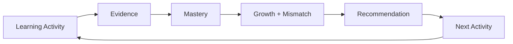
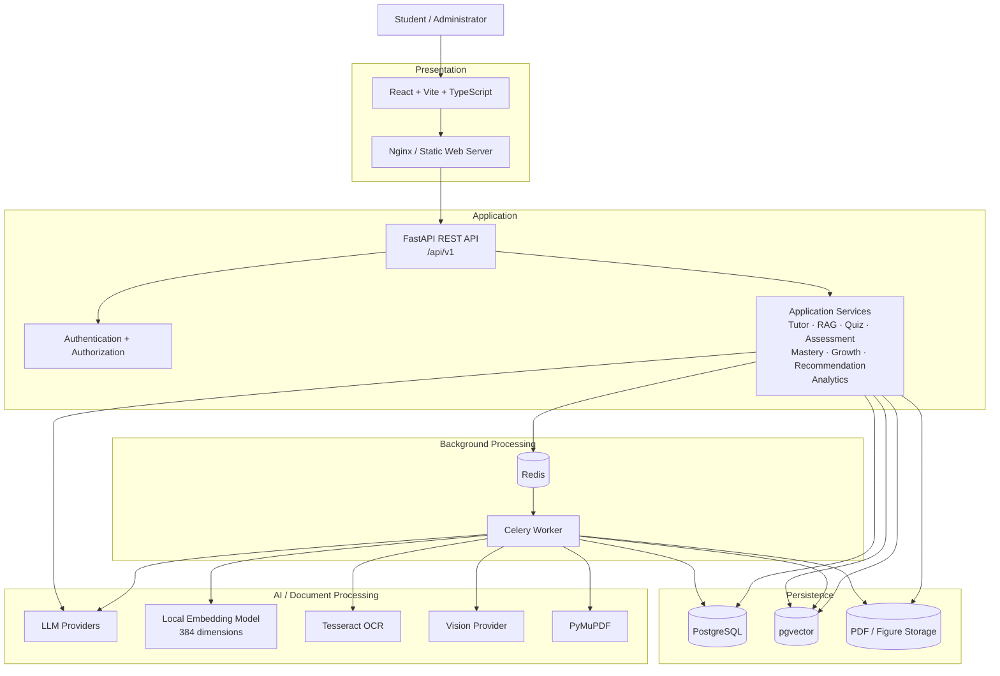
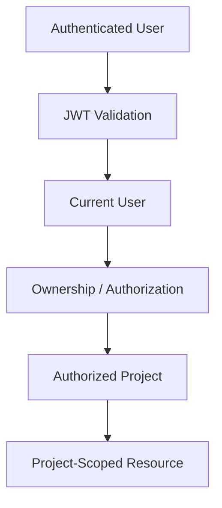
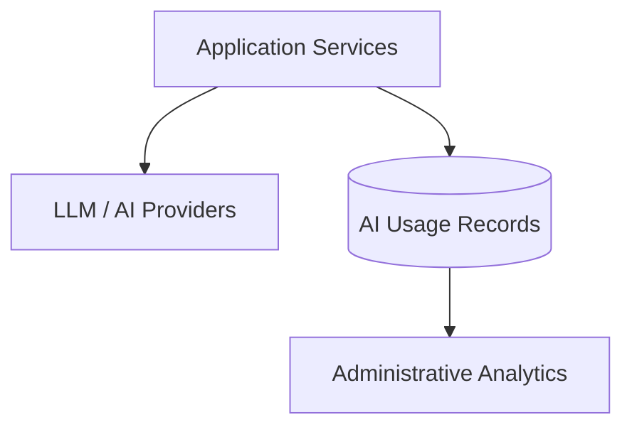

# AI Study Companion

> Project-scoped AI learning platform — upload PDFs, get a structured `Topic → Subtopic → Concept` knowledge map, learn with a RAG-grounded tutor, prove mastery through adaptive quizzes and open-ended assessment, and get deterministic, explainable recommendations for what to study next.

[](https://aistudycompanion-alpha.vercel.app/)
[](./backend)
[](./docker-compose.yml)
[](#license)

**Live app:** https://aistudycompanion-alpha.vercel.app/


---

## Table of Contents

- [The Learning Loop](#the-learning-loop)
- [Product Tour](#product-tour)
- [Live Deployment](#live-deployment)
- [Key Features](#key-features)
- [How It Works](#how-it-works)
- [Architecture](#architecture)
- [Tech Stack](#tech-stack)
- [Repository Structure](#repository-structure)
- [Prerequisites](#prerequisites)
- [Quick Start](#quick-start)
- [Configuration](#configuration)
- [API Reference](#api-reference)
- [Frontend Guide](#frontend-guide)
- [Learning Model](#learning-model)
- [AI Usage](#ai-usage)
- [Security](#security)
- [Testing](#testing)
- [Deployment](#deployment)
- [Documentation Index](#documentation-index)
- [Project Status & Known Boundaries](#project-status--known-boundaries)
- [License](#license)

---

## The Learning Loop

Everything in the system is one closed loop — activity produces evidence, evidence produces mastery, mastery produces the next activity:



Detailed system design lives in [`Architecture.md`](./Architecture.md). AI tooling transparency lives in [`AI_USAGE.md`](./AI_USAGE.md).

---

## Product Tour

| | |
|---|---|
| **Home dashboard** — continue learning, recent activity, attention items, next action | **Project dashboard** — progress, concepts, performance, next step |
|  |  |
| **AI tutor with citations** — grounded answers, per-chunk sources | **Recommended quiz** — deterministic next-best practice |
|  |  |
| **Practice session** — targeted applied work | **Analytics** — growth, mastery trends, project stats |
|  |  |

<details>
<summary><b>More screens: flashcards, admin, activity</b></summary>

| | |
|---|---|
| **Flashcard question (SM-2)** | **Flashcard answer + self-grade** |
|  |  |
| **Admin activity** — users, events, engagement | **Admin AI usage** — provider, model, tokens, latency, cost |
|  |  |
| **Admin AI usage (detail)** | |
|  | |

</details>

---

## Live Deployment

| Surface | URL | Notes |
|---------|-----|-------|
| Frontend (production) | **https://aistudycompanion-alpha.vercel.app/** | Deployed on Vercel, points at the hosted FastAPI backend |
| Backend API (local) | `http://localhost:8000` | FastAPI root |
| Backend docs (local) | `http://localhost:8000/docs` | Auto-generated OpenAPI / Swagger UI |
| Health check | `GET /api/v1/health` → `{"status":"ok"}` | Also used as Railway healthcheck |
| Web (Docker) | `http://localhost:5173` | Nginx-served production frontend build |

---

## Key Features

### Document Ingestion & Knowledge Extraction

- PDF-only upload (`≤ 10 MB`, magic-byte + extension + content-type validated).
- Async pipeline: **PyMuPDF extraction → Tesseract OCR (scanned pages) → table extraction → figure/vision captioning → chunking (2000 chars / 200 overlap) → 384-d local embeddings → pgvector**.
- Two-pass LLM structure extraction into **`Topic → Subtopic → Concept`** with Pydantic validation, retry, and idempotent upserts (no duplicates on re-run).
- Observable via `background_jobs` (`pending → running → completed / failed`) with per-material error messages.



### RAG-Grounded Tutor

- Project-scoped pgvector retrieval (top-5 chunks) behind an evidence-support gate (`distance ≤ 0.5`, `≤ 6000 chars` context).
- Refuses cleanly on insufficient evidence instead of hallucinating.
- Answers include source citations; conversations persisted in `tutor_messages`.
- Explicit **Tutor Check / Explain-It-Back** flow grades the student's explanation and appends real tutor mastery evidence.


### Adaptive Assessment

- **MCQ quizzes:** weakest-first ordering + difficulty bands (`<34` Easy, `34–66` Medium, `>66` Hard), schema-validated LLM generation, server-side scoring.
- **Answer-time adaptation:** after each answer, mastery is recomputed and the next unanswered question is selected deterministically (mastery + difficulty match + exposure + curriculum order).
- **Open-ended assessment:** LLM grading with verdict + feedback, persisted as applied evidence.
- **Practice, Flashcards (SM-2 scheduling), and figure/table-aware questions** round out the activity set.


### Deterministic Learning Analytics

- Five append-only evidence streams: **tutor, quiz, practice/applied, flashcard, open-ended** → `mastery_evidence`.
- EMA mastery per stream: `Mₖ = Mₖ₋₁ + wₖ(Sₖ − Mₖ₋₁)` with difficulty/gap weighting and caps, aggregated into **`mcq_mastery` / `applied_mastery` → final mastery + status**.
- **Growth** via EMA prefix replay (decline `≤ −10` boosts recommendation score by `+15`).
- **Mismatch** from MCQ-vs-Applied gap + evidence counts + calibration (e.g. overconfident-but-wrong).
- **Recommendations** from weakness + uncertainty + recency + goal alignment + growth + action base − repetition ± mismatch. Fully deterministic — the LLM never picks the final recommendation.


### Platform

- Spaces → Projects hierarchy with strict ownership (`user → space → project`).
- JWT (HS256) auth + Argon2id passwords + per-project authorization (`404`, never `403`, to avoid leaking existence).
- Admin read-only analytics + AI-usage/cost tracking (provider, model, tokens, latency, cost — never prompt text).
- Central JSON error envelope, per-minute LLM rate limits (user + project), CORS allow-list.

---

## How It Works

### 1. Knowledge Ingestion (async)

Upload → validate → material + job records → Redis → Celery worker → PyMuPDF pages → OCR / tables / figures+vision → chunks + 384-d embeddings (pgvector) + `Topic → Subtopic → Concept` (Postgres).

Long-running document work never blocks the API:



### 2. Grounded Tutor (RAG)

Every answer is retrieved first, then generated — weak evidence refuses before the LLM is ever called:



Tutor Check closes the loop from chat to real evidence:



### 3. Adaptive Quiz + Measurement

Generation adapts to mastery, then each answer re-adapts the next question:



Evidence becomes the next activity through one deterministic loop:



---

## Architecture

Modular monolith with async workers — **not** microservices. One FastAPI app, domain services, thin routers, background Celery workers.



Key boundaries:

- Frontend never touches Postgres, Redis, Celery, or AI keys directly.
- Routers are thin; mastery, retrieval, quiz adaptation, evidence, growth, mismatch, and recommendations live in services.
- All study queries are `WHERE project_id = …` — including the vector search.
- AI output is untrusted until Pydantic-validated; `mastery_evidence` is append-only.

Every request passes the same guard chain:



All LLM traffic is metered (never storing prompt text):



Full diagrams (ingestion, RAG, quiz, mastery, growth/mismatch, recommendations, security, Docker vs Railway topologies, sequence diagrams) are in [`Architecture.md`](./Architecture.md).

---

## Tech Stack

| Layer | Technology |
|-------|------------|
| Frontend | React 19 + TypeScript + Vite + React Router + Axios |
| Styling / UI | Tailwind CSS, shadcn/ui pattern, Framer Motion, lucide-react, Recharts, KaTeX + Markdown (GFM/math) |
| Backend | FastAPI + Pydantic + SQLAlchemy + Alembic |
| API | REST / JSON, versioned at `/api/v1` |
| Database | PostgreSQL 16 + pgvector |
| Auth | JWT (HS256) + Argon2id |
| Background | Celery + Redis |
| PDF / OCR | PyMuPDF (worker only) + Tesseract + Pillow |
| Embeddings | `BAAI/bge-small-en-v1.5` via FastEmbed — 384 dimensions, local, no key |
| Text generation | Groq (`openai/gpt-oss-20b` default) or Inception Mercury 2.5 (`LLM_PROVIDER` switch) |
| Vision | NaraRouter OpenAI-compatible endpoint (`stepfun-3.7-flash`), OCR/placeholder fallback |
| Local orchestration | Docker Compose (5 services: `api`, `worker`, `web`, `postgres`, `redis`) |
| Cloud | Railway (single-container Supervisor: API + worker + Redis) + Vercel (frontend) |
| Process mgmt | Supervisor (Railway/demo image) |

> Note: earlier docs referenced OpenAI `text-embedding-3-small` (1536-d). The current implementation defaults to **local 384-d embeddings**. Switching providers requires a migration — the two widths cannot mix in one column.

---

## Repository Structure

```text
.
├── frontend/                 # React + Vite + TS app (deployed to Vercel)
│   ├── src/
│   │   ├── features/         # tutor, quiz, practice, openended, flashcards,
│   │   │                     # structure, dashboard, analytics, spaces, projects, …
│   │   ├── components/       # shared UI (AppShell, ProtectedRoute, …)
│   │   ├── context/          # AuthContext
│   │   ├── lib/              # apiClient (axios + JWT interceptor)
│   │   └── App.tsx           # routes: /, /login, /register, /spaces, /admin
│   ├── Dockerfile            # multi-stage build → nginx
│   └── .env.example          # VITE_API_BASE_URL, VITE_API_V1_PREFIX
├── backend/                  # FastAPI app
│   ├── app/
│   │   ├── main.py           # app factory, CORS, /api/v1 router wiring
│   │   ├── api/v1/           # thin routes: auth, spaces, projects, materials,
│   │   │                     # structure, tutor, quizzes, assessment, practice,
│   │   │                     # flashcards, figures, knowledge, dashboard,
│   │   │                     # growth, analytics, admin, jobs, health, me
│   │   ├── services/         # domain logic (tutor, RAG, quiz, mastery, …)
│   │   ├── core/             # settings, security, JWT, error envelope
│   │   ├── db/               # Base, session, SessionLocal / get_db
│   │   ├── models/           # users, spaces, projects, materials, topics, …
│   │   ├── schemas/          # Pydantic request/response contracts
│   │   └── worker/           # Celery app + tasks (extraction, embeddings, …)
│   ├── alembic/              # migrations (reproducible schema changes)
│   ├── tests/                # pytest suite (incl. tests/security/)
│   ├── Dockerfile            # python:3.11-slim
│   ├── supervisord.conf      # all-in-one Railway/demo process layout
│   └── .env.example          # full backend template (placeholders only)
├── docs/                     # blueprint analysis, ADRs, status, prompts, …
│   └── images/               # product screenshots used in this README
├── Architecture.md           # canonical system architecture + Mermaid diagrams
├── AI_USAGE.md               # dev-AI vs product-AI transparency record
├── docker-compose.yml        # canonical local full-stack (5 services)
├── railway.toml              # Railway Dockerfile + healthcheck pin
└── README.md                 # this file
```

`backend/` and `frontend/` are independently runnable and share only the documented `/api/v1` JSON contracts (Pydantic schemas ↔ TS types).

---

## Prerequisites

- **Node.js 20+** and npm (frontend)
- **Python 3.11+** (backend)
- **Docker + Docker Compose** (Postgres, Redis, full-stack runs)
- **API keys** (never committed): Groq and/or Inception, NaraRouter (vision). Embeddings work locally with no key.

---

## Quick Start

### 1. Clone and configure environment

```bash
# Backend — copy template and fill real values
cp backend/.env.example backend/.env

# Frontend — copy template
cp frontend/.env.example frontend/.env
```

Windows (PowerShell) equivalent of `cp`: `Copy-Item backend/.env.example backend/.env`.

Real `.env` files are gitignored. Only `.env.example` (placeholders) is committed.

Minimum backend values: `DATABASE_URL`, `JWT_SECRET` (≥ 32 random chars), `LLM_PROVIDER`, `GROQ_API_KEY` and/or `INCEPTION_API_KEY`, `REDIS_URL` / `CELERY_*`, `UPLOAD_DIR`. Minimum frontend value: `VITE_API_BASE_URL` (default `http://localhost:8000`).

> Compose quirk: `docker-compose.yml` `environment:` overrides `backend/.env` inside containers. Export LLM keys in the same shell before `docker compose up` (see `backend/.env.example` header), or set them in your shell / hosting provider env.

### 2. Option A — Docker Compose (canonical full stack, recommended)

```bash
docker compose up --build
```

| Service | URL |
|---------|-----|
| API | http://localhost:8000 |
| API docs | http://localhost:8000/docs |
| Web | http://localhost:5173 |
| Postgres | `localhost:5433` → container `5432` (host `5433` avoids clashing with a local Postgres on `5432`) |
| Redis | `localhost:6379` |

Compose runs exactly 5 services: `api`, `worker`, `web`, `postgres`, `redis`. Browsers use `localhost:8000`; containers talk to each other via service names (`postgres`, `redis`). Uploads live on the shared `uploads:/data/uploads` volume mounted identically in `api` and `worker`.

### 3. Option B — Local dev without Docker (backend + frontend separately)

```bash
# Backend
cd backend
python -m venv .venv
# Windows: .venv\Scripts\activate
# macOS/Linux: source .venv/bin/activate
pip install -r requirements.txt
alembic upgrade head
uvicorn app.main:app --reload --port 8000
```

```bash
# Frontend (separate terminal, from repo root)
cd frontend
npm install
npm run dev      # → http://localhost:5173
npm run build    # verify production build
```

For local dev without Docker, point `DATABASE_URL` / `REDIS_URL` at `localhost` instead of `postgres` / `redis` (see comments in `backend/.env.example`).

### 4. Smoke checks

```bash
# Backend health
curl http://localhost:8000/api/v1/health

# Backend tests (from backend/)
python -m pytest -q

# Frontend build (from frontend/)
npm run build
```

---

## Configuration

Backend (`backend/.env`, see `.env.example` for full comments):

| Variable | Purpose / Default |
|----------|-------------------|
| `DATABASE_URL` | SQLAlchemy URL, psycopg3 scheme (`postgresql+psycopg://…`). Compose: `@postgres:5432/…`; local: `@localhost:5433/…`; Neon: `?sslmode=require` |
| `JWT_SECRET` / `JWT_ALGORITHM` / `JWT_EXPIRE_MINUTES` | Auth signing (`HS256`, default expiry `2880` min). Use a long random secret |
| `LLM_PROVIDER` | `groq` or `inception` (Mercury temps are clamped to `0.5–1` automatically) |
| `GROQ_API_KEY` / `GROQ_MODEL` | e.g. `openai/gpt-oss-20b` |
| `INCEPTION_API_KEY` / `INCEPTION_MODEL` | e.g. `mercury-2.5` |
| `EMBEDDING_PROVIDER` | `local` (default, FastEmbed 384-d) or `openai` (1536-d, needs column migration) |
| `OCR_ENABLED` / `OCR_LANGUAGE` / `OCR_DPI` | Tesseract worker settings (`true` / `eng` / `300`) |
| `TABLES_ENABLED` / `VISION_ENABLED` / `VISION_MODEL` / `VISION_MAX_IMAGES_PER_DOC` | Extraction toggles (`stepfun-3.7-flash`, max 12 images/doc) |
| `NARAROUTER_API_KEY` / `NARAROUTER_BASE_URL` / `NARAROUTER_MODEL` | Vision endpoint (`…/chat/completions`) |
| `REDIS_URL` / `CELERY_BROKER_URL` / `CELERY_RESULT_BACKEND` | Same Redis for API + worker (`redis://redis:6379/0` in Compose) |
| `UPLOAD_DIR` | `/data/uploads` — must match in `api` + `worker` |
| `API_V1_PREFIX` / `CORS_ORIGINS` | `/api/v1`; comma allow-list, never `*` in prod |
| `RATE_LIMIT_LLM_PER_MINUTE_USER` / `_PROJECT` / `RATE_LIMIT_WINDOW_SECONDS` | AI cost guardrails (`30` / `120` / `60`) |

Frontend (`frontend/.env`):

| Variable | Purpose / Default |
|----------|-------------------|
| `VITE_API_BASE_URL` | Browser → FastAPI base (`http://localhost:8000`; production Vercel value points at hosted API) |
| `VITE_API_V1_PREFIX` | `/api/v1` |

---

## API Reference

All routes under `/api/v1`. Auth: `Authorization: Bearer <JWT>` on everything except `auth/*` and health.

| Area | Representative endpoints |
|------|--------------------------|
| Health | `GET /health` |
| Auth | `POST /auth/register` (201), `POST /auth/login`, `GET /auth/me`, `GET /me` |
| Spaces | `POST /spaces`, `GET /spaces`, `GET /spaces/{space_id}` |
| Projects | `POST /spaces/{space_id}/projects`, `GET /spaces/{space_id}/projects`, `GET /projects/{project_id}`, `GET /spaces/{space_id}/projects/{project_id}` |
| Materials | `POST /projects/{id}/materials` (multipart PDF), `GET /projects/{id}/materials` |
| Structure | `GET /projects/{id}/structure` → nested `Topic → Subtopic → Concept` |
| Tutor | `POST /projects/{id}/tutor/ask`, Tutor Check / thread endpoints |
| Quizzes | quiz generate / attempt start / answer / complete |
| Assessment | `POST /assessment/open-ended`, Explain-It-Back |
| Practice / Flashcards / Figures / Knowledge | practice sessions, SM-2 reviews, figure captions, knowledge tree |
| Dashboard / Growth / Analytics | recommendations + dashboard, growth series, project analytics, admin analytics |
| Jobs | `GET /jobs/{job_id}` (background-job status) |

Interactive reference: `http://localhost:8000/docs`.

---

## Frontend Guide

- `src/lib/axios.ts` — single `apiClient` (`VITE_API_BASE_URL` + `VITE_API_V1_PREFIX`), Bearer interceptor, 401 auto-redirect. No hard-coded URLs elsewhere.
- `src/context/AuthContext.tsx` — token in `localStorage`, `/auth/me` hydration, login/register/logout.
- Routes: `/` (landing or home dashboard), `/login`, `/register`, `/spaces`, `/spaces/:spaceId`, `/spaces/:spaceId/projects/:projectId`, `/admin` (admins only), `*` → 404.
- Feature folders mirror the backend domains: `tutor/`, `quiz/`, `practice/`, `openended/`, `flashcards/`, `structure/`, `dashboard/`, `analytics/`, `overview/`, `progress/`, `spaces/`, `projects/`, `admin/`.

---

## Learning Model

- **Knowledge:** `Project → Topic → Subtopic → Concept` (+ relationships). Identity = normalized title within parent; `project_id` denormalized for isolation.
- **Evidence:** append-only `mastery_evidence` (never updated in place). No persisted `concept_mastery` table — mastery is derived.
- **Mastery:** per-stream EMA with difficulty/gap weights → `mcq_mastery` + `applied_mastery` → final + status.
- **Growth:** EMA prefix replay → per-concept final trend → decline signal into recommendations.
- **Mismatch:** MCQ-vs-Applied gap + counts + calibration → signal (not a separate persisted state).
- **Recommendations:** deterministic weighted score → eligibility → winner → surfaced on dashboard/practice.


---

## AI Usage

Summary — full record in [`AI_USAGE.md`](./AI_USAGE.md):

**Product AI (what the app does with AI):**

- LLM: structure extraction, grounded tutor answers, thread titles, tutor→quiz mapping, MCQ + open-ended generation/grading, Explain-It-Back / Tutor-Check grading — all as validated structured JSON with retries.
- Vision-language: figure/chart/table captioning via NaraRouter (`stepfun-3.7-flash`) with OCR/placeholder fallback.
- Embeddings/retrieval: local `BAAI/bge-small-en-v1.5` (384-d) + pgvector project-scoped search.
- Deterministic tooling (not LLM): PyMuPDF + Tesseract extraction, chunking, RAG assembly, EMA mastery, growth replay, recommendations, mismatch, adaptive selection, SM-2, calibration, cost estimation.

**Development AI (how the app was built):** OpenCode (Muse Spark 1.x, Mercury 2.5), VS Code Copilot (Claude Haiku, GPT-5.x), Antigravity/Gemini, Figma Make (UI exploration), ChatGPT / Claude / Gemini (architecture, deployment, prompt design). Prompt history: `docs/opencode-prompts.md`, `ai-prompts-history.txt`, `opencode.json`, Git history.

**Responsible-AI notes:** RAG support-gate + refusal on weak evidence, citations, Pydantic validation before persistence, no prompt-text retention in usage logs, per-user/per-project LLM rate limits, and deterministic (auditable) mastery/recommendation math.

---

## Security

- Argon2id password hashing only; no plaintext/bcrypt/reversible storage.
- JWT bearer on every `/api/*` route except `auth/*`; `require_project_access` per project route.
- `project_id` isolation on every study query (service-layer `WHERE project_id = …`, including vector search).
- Uploads size-capped + content-sniffed, worker-only PyMuPDF, shared volume outside web root, traversal-safe server UUID paths.
- AI output validated (Pydantic) before persistence; uploaded text treated as data, never instructions.
- CORS allow-list (never `*`); central error envelope avoids stack/secret leakage.
- Secrets only via environment; `.env` gitignored; `.env.example` contains placeholders only.

---

## Testing

```bash
cd backend
python -m pytest -q            # full suite
python -m pytest tests/security -q   # rate-limit / hardening tests
```

```bash
cd frontend
npm run build                  # production build gate
npm run lint                   # oxlint
```

Migrations:

```bash
cd backend
alembic upgrade head
alembic current                # confirm head revision
```

---

## Deployment

| Target | How |
|--------|-----|
| **Frontend (live)** | Vercel → https://aistudycompanion-alpha.vercel.app/ (build: `tsc -b && vite build`; env: `VITE_API_BASE_URL` = hosted API) |
| **Local full stack** | `docker compose up --build` — `api` (uvicorn) + `worker` (Celery) + `web` (nginx) + `postgres` (pgvector) + `redis` |
| **Railway backend** | Single container from `backend/Dockerfile` via `railway.toml` (`DOCKERFILE` builder, healthcheck `/api/v1/health`), Supervisor runs API + worker + Redis client against managed Postgres/Redis |

Docker vs Railway topologies differ intentionally (separate Compose services vs one Supervised container) — see `Architecture.md §10.4`.

---

## Documentation Index

| Document | Contents |
|----------|----------|
| [`Architecture.md`](./Architecture.md) | System architecture, Mermaid diagrams, flows, trade-offs, current boundaries |
| [`AI_USAGE.md`](./AI_USAGE.md) | Dev-AI vs product-AI transparency, models, what AI does/doesn't do |
| [`docs/00-blueprint-analysis.md`](./docs/00-blueprint-analysis.md) | Frozen blueprint contract (scope, stack, exclusions, hard rules) |
| [`docs/architecture-decisions.md`](./docs/architecture-decisions.md) | ADRs 001–009 |
| [`docs/implementation-status.md`](./docs/implementation-status.md) | Phase-by-phase build log (58-phase roadmap) |
| [`docs/opencode-prompts.md`](./docs/opencode-prompts.md) | Per-phase prompt log |
| [`docs/learning-model-design.md`](./docs/learning-model-design.md) | Mastery/growth/mismatch math |
| [`docs/storage.md`](./docs/storage.md) / [`docs/usage-tracking.md`](./docs/usage-tracking.md) | Upload volume contract / AI cost tracking |
| [`docs/evaluation-report.md`](./docs/evaluation-report.md) | Evaluation notes |

---

## Project Status & Known Boundaries

Implementation follows a 58-phase roadmap (see `docs/implementation-status.md`). The architecture doc deliberately describes the **current** implementation — including these honest boundaries:

1. Tutor evidence needs an explicit in-project `concept_id` (no auto concept detection from free text yet).
2. Tutor Check API exists, but one-click Tutor Check UI isn't fully integrated into the Tutor view.
3. Quiz adaptation selects from pre-generated questions (no unlimited mid-attempt generation).
4. Growth → recommendations currently flows mainly through the decline signal; improving/stable histories are neutral.
5. Per-answer mastery updates don't auto-recompute recommendations (dashboard/completion flows do).
6. Some background retry/dispatch-failure paths are still incomplete.
7. No production golden dataset / human groundedness judgment framework yet.
8. Mastery is derived from append-only evidence (no `concept_mastery` table).
9. Tutor generation doesn't use full persisted conversation history as model context.

Out of scope for the prototype (per blueprint): flashcards-as-originally-scoped extras, standalone AI notes, dependency maps, study planner, spaced repetition beyond SM-2 flashcards, audio/video, collaboration, gamification, notifications, exam-readiness score, live lectures, LangChain/LangGraph, Kafka/RabbitMQ, microservices, separate vector DB, ad-hoc Redis caching.

---

## License

Prototype — internal use for the AI Study Companion challenge.
